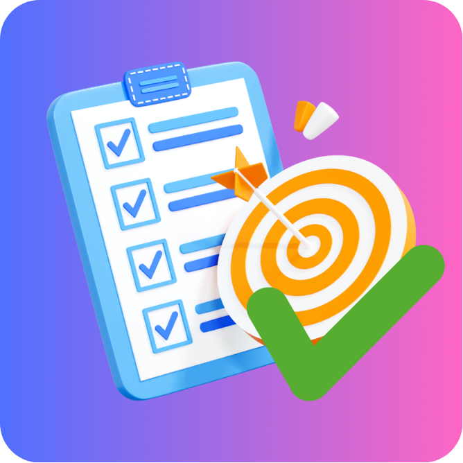
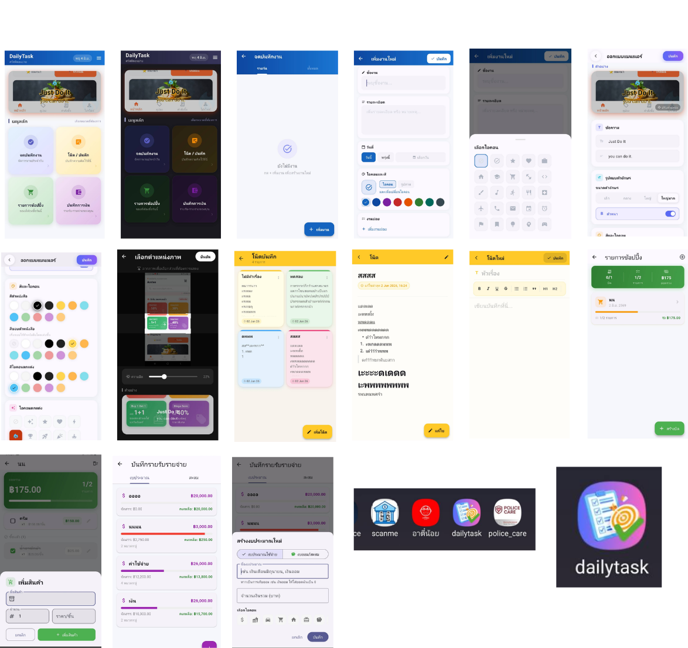

# Application : DailyTask

  

  <b>DailyTask</b> 
  แอปพลิเคชันสำหรับจัดการงาน จดบันทึก และวางแผนชีวิตประจำวัน  
  รวมทุกฟังก์ชันการจดไว้ในแอปเดียว

---

# Preview Application

  

---

# About Application

   DailyTask เป็นแอปพลิเคชันที่พัฒนาด้วย Flutter
เพื่อช่วยให้ผู้ใช้งานสามารถจัดการงานและบันทึกข้อมูลต่าง ๆ ในชีวิตประจำวันได้อย่างเป็นระบบ
ผู้ใช้งานสามารถสร้างรายการงานที่ต้องทำ (To-Do List) จดบันทึกข้อความสำคัญ บันทึกโน้ตส่วนตัว
จัดทำรายการซื้อของ รวมถึงบันทึกรายรับรายจ่าย ภายในแอปพลิเคชันเดียว แอปถูกออกแบบให้ใช้งานง่าย 
ช่วยเพิ่มประสิทธิภาพในการวางแผนงาน การจัดการเวลา และการติดตามข้อมูลสำคัญในชีวิตประจำวัน

---

# Features

- สร้างและจัดการรายการงานที่ต้องทำ (To-Do List)
- จดบันทึกข้อความและข้อมูลสำคัญได้อย่างสะดวก
- บันทึกไอเดีย ความคิด และข้อมูลส่วนตัว
- สร้างรายการซื้อของและติดตามรายการที่ต้องการซื้อ
- บันทึกรายรับรายจ่าย พร้อมสรุปข้อมูลทางการเงิน
- ปรับแต่งสีและรูปแบบการแสดงผลของแอปได้
- กำหนดไอคอนและหมวดหมู่ให้กับงานหรือบันทึกแต่ละประเภท
- ช่วยจัดระเบียบงานและกิจกรรมในแต่ละวัน
- ค้นหาและจัดการข้อมูลได้อย่างรวดเร็ว
- ออกแบบ UI ให้ใช้งานง่าย สวยงาม และเหมาะกับการใช้งานประจำวัน

---

# Technology Stack

- Flutter
- Dart
- Local Storage
- Material Design
- Hive local storange

---

# Developer
Developed by Kittanai Srikham  
